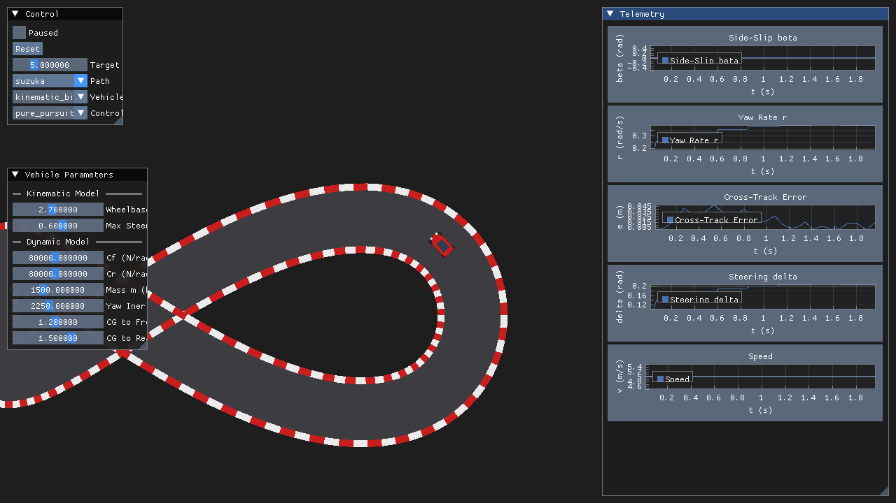
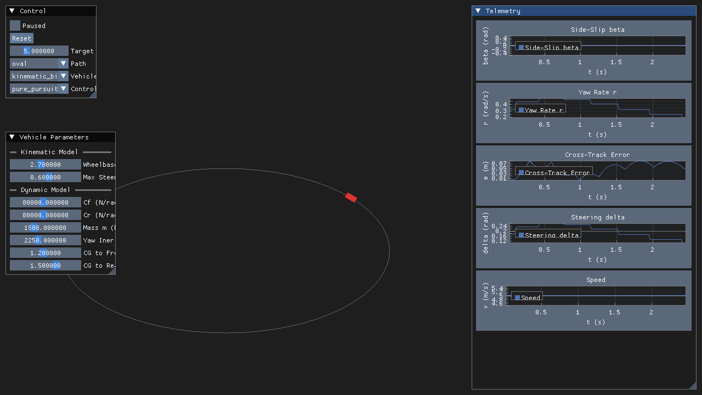
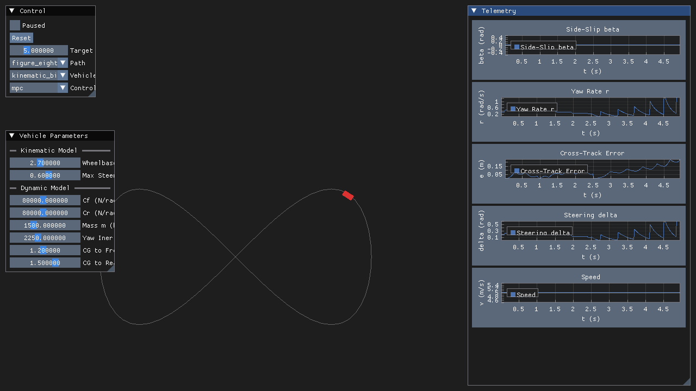

# Car-Like Mobile Robot Simulator

A bird's-eye-view 2D simulator for a car-like (Ackermann/bicycle model) mobile robot, built to practice the
modeling, control, and software-architecture skills used in autonomous-driving software engineering. A
vehicle follows a reference path; the vehicle model and path-tracking controller are swappable at runtime,
physical parameters are tunable via sliders, and telemetry is plotted live.





## Features

- **Vehicle models** (swappable at runtime): `KinematicBicycleModel` (RK4-integrated rear-axle kinematics)
  and `DynamicBicycleModel` (2-DOF lateral dynamics with a linear tire model).
- **Controllers** (swappable at runtime): `PurePursuitController` (adaptive lookahead), `StanleyController`
  (front-axle heading + cross-track error), and `MPCController` (linear MPC over a lateral error model,
  solved each step as a condensed QP via Eigen).
- **Reference paths**: closed oval and figure-eight, plus five stylized real-world circuit shapes --
  Suzuka, Monaco, Silverstone, Spa-Francorchamps, and Monza -- selectable live. These are scaled-down
  approximations of each circuit's recognizable silhouette/corner sequence, not surveyed GPS coordinates.
- **Road rendering**: each path is drawn as a filled asphalt road ribbon with alternating red/white curbs,
  not just a centerline outline. The car itself is a procedural vector silhouette (tapered body, cabin,
  headlights, wheels) rather than a plain rectangle.
- **Live tuning**: vehicle physical parameters (wheelbase, max steer, cornering stiffness, mass, yaw inertia,
  CG offsets) via ImGui sliders, applied on the very next simulation step.
- **Telemetry**: live ImPlot time-series of side-slip angle, yaw rate, cross-track error, steering command,
  and speed.
- **YAML startup config** (`config/config.yaml`): initial vehicle parameters, path, model, controller, and
  target speed, with graceful fallback to defaults if the file is missing or partially filled in.

## Build & run

Requires CMake ≥ 3.20 and a C++17 compiler. SFML, Dear ImGui, imgui-sfml, and ImPlot are fetched
automatically by CMake; Eigen3 and yaml-cpp are expected as system packages (`libeigen3-dev`,
`libyaml-cpp-dev` on Ubuntu/Debian).

```sh
cmake -S . -B build -DCMAKE_BUILD_TYPE=Release   # first run also fetches+builds SFML from source
cmake --build build -j"$(nproc)"
./build/car_sim                                   # run from the repo root so config/config.yaml is found
```

## Architecture

The codebase is split into five modules under `include/<module>/` + `src/<module>/`:

- `core/` — vehicle state/params, the kinematic and dynamic bicycle models, path geometry (including the
  five circuit shape generators), YAML config.
- `controller/` — Pure Pursuit, Stanley, and MPC controllers, all behind a common `IController` interface.
- `engine/` — `SimulationEngine` (the fixed-timestep update loop) and `ModelFactory` (builds models/
  controllers by name, so new ones become selectable in the UI without touching the GUI code).
- `renderer/` — SFML-based 2D rendering with a follow-camera: an asphalt road ribbon with curbs, and a
  procedural vector car silhouette.
- `gui/` — ImGui/ImPlot panels for parameters, playback control, and telemetry.

Models and controllers are Strategy-pattern implementations swappable at runtime; the renderer and GUI
panels observe the simulation via the Observer pattern; `ModelFactory` is a Factory keyed by string name.
See `CLAUDE.md` for a much more detailed architecture/math writeup (it's written for an AI coding agent to
work in this repo, but doubles as deep documentation for a human reader too).
